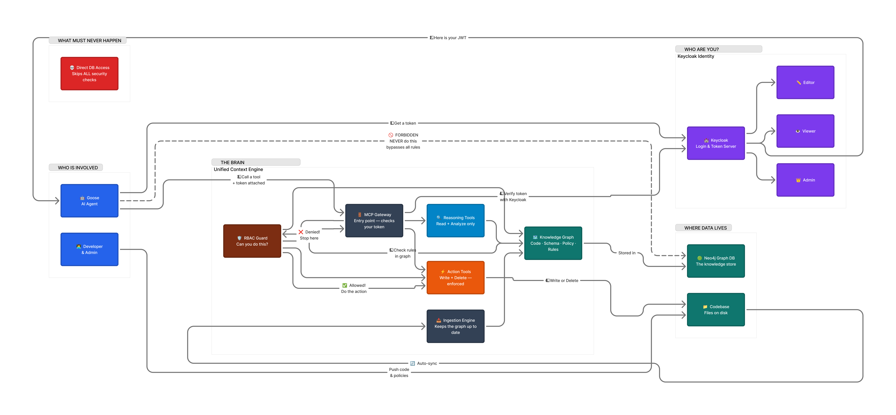
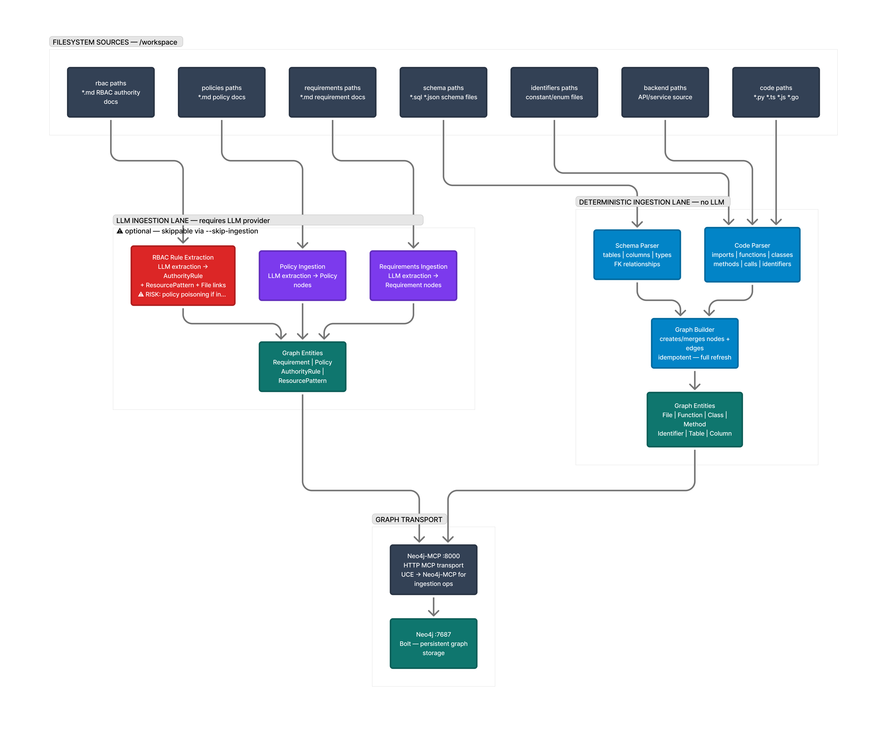
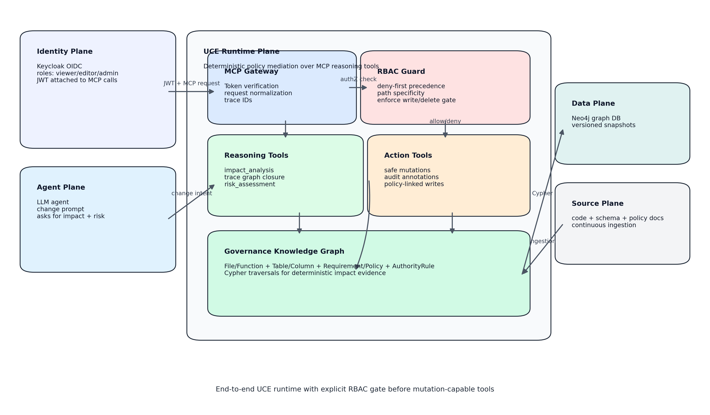
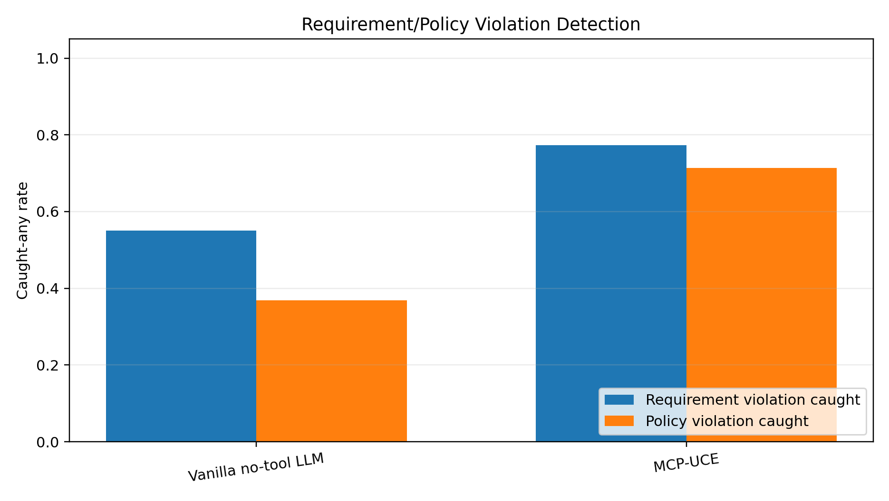
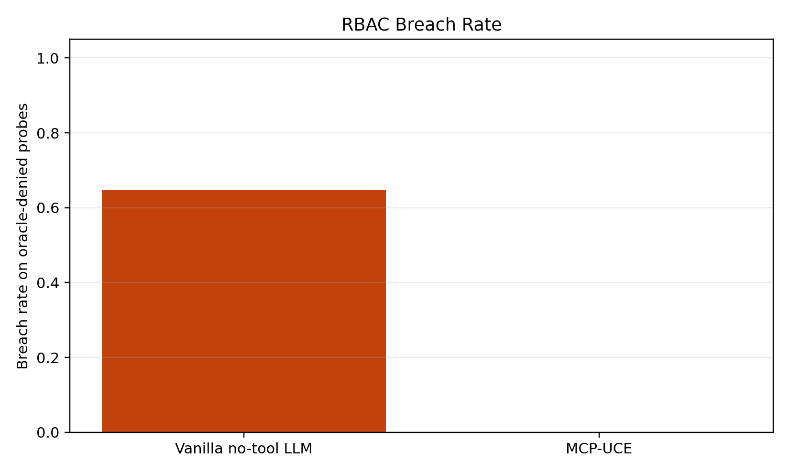

# Unified Context Engine (UCE)

UCE is a policy-aware context and governance engine for software-changing AI assistants.

It builds a deterministic graph over code, schema, requirements, policies, and RBAC rules, then exposes reasoning and guarded mutation tools through MCP.

## What Problem UCE Solves

Most assistants can write code, but they cannot reliably answer:

- Which requirement will this break?
- Which policy is affected?
- Who is authorized to edit this file/path?
- What is the blast radius across imports, schema, and backend paths?

UCE was built to close this trust gap with deterministic graph reasoning and RBAC enforcement.

## Background and Motivation

This project started from an on-premise assistant goal: keep private engineering context local while still getting useful AI support.

The project evolved into UCE because "better prompts" alone were not enough for governance-critical workflows. Teams need auditable, reproducible evidence for change impact and authorization decisions.

Canonical final report:

- `research/final_report/CS540_Final_Project_Report_UCE_Preet_Patel.docx`

Supplemental benchmark artifacts:

- `research/supplemental_benchmarks/`

## How UCE Works

1. Ingest deterministic context into Neo4j:
- code structure (files/functions/classes/imports)
- schema (tables/columns)
- requirements and policies
- RBAC authority rules

2. Expose graph-backed MCP tools:
- `propose_change` — the gate: agent declares files/requirements, UCE checks it against the
  real blast radius, governance, and RBAC, and returns allow/warn/block plus a `gate_token`
- impact/risk/explain tools
- introspection tools
- authorization + gated write/delete tools

3. Enforce the gate at mutation time — not just advisory:
- `write_file`/`delete_file` require a `gate_token` minted only by a successful `propose_change`
  call; there is no code path to a filesystem mutation that skips the gate
- viewer/editor/admin token claims
- deny-by-default mode support
- path-specific allow/deny logic

## Architecture

High-level architecture:



Deterministic vs optional LLM ingestion lanes:



Generated benchmark architecture figure:



## Core Capabilities

- **`propose_change` gate**: deterministic allow/warn/block decision comparing a caller's
  declared plan against the real import/call blast radius and RBAC — not optional advice.
  `write_file`/`delete_file` require the `gate_token` it mints; they cannot execute without one.
- **`explain_violation`**: literal requirement/policy document text plus exact trace chains —
  zero LLM involvement, nothing paraphrased or summarized.
- Deterministic graph ingestion for code/schema/governance artifacts.
- Optional LLM-assisted extraction for underspecified docs.
- Graph reasoning tools for impact, explainability, and preflight risk (best-effort/exploratory —
  see the tool catalog below for which tools are enforcement-grade vs. which guess from text).
- JWT-backed RBAC gate with deny-by-default support.
- Full local stack via Docker Compose (Neo4j + Keycloak + Neo4j-MCP + UCE MCP).

## Data Privacy: Self-Hosted, Local-First by Default

UCE is distributed for you to run — there is no multi-tenant hosted service that ingests your
code. `pip install uce-engine` or `docker pull`/`docker compose up` all stand up a private
instance on your own machine or infrastructure; your source code, schema, requirements, and
policies never leave that instance unless you explicitly configure a remote LLM provider.

**What stays local, always:**

- Code parsing, schema parsing, the Neo4j knowledge graph, and every deterministic reasoning
  tool (`impact_analysis`, `propose_change`, `explain_violation`, `authorize_change`, RBAC
  evaluation) — none of this makes a network call to anywhere outside your own Neo4j instance.
  This is the entire enforcement path: the gate that decides allow/warn/block never talks to an
  LLM or any third party.
- RBAC tokens are validated against your own self-hosted Keycloak; nothing is sent to Anthropic,
  OpenAI, or anyone else for authorization decisions.
- UCE has no telemetry, analytics, or usage reporting of its own. (The optional Neo4j-MCP sidecar
  used only by the LLM-assisted ingestion lane has its own `NEO4J_TELEMETRY` setting, which the
  shipped Docker Compose profile sets to `false` by default.)

**What is opt-in and remote, clearly scoped:**

- LLM-assisted ingestion (extracting structure from underspecified requirement/policy documents)
  is the only feature that sends text to a third party, and only the document text you point it
  at — never your source code, never graph data. It runs only when you explicitly call the LLM
  ingestion path, and only for the provider you configure.
- For a fully local, zero-outbound-network setup — including the LLM-assisted ingestion lane —
  point it at a local model server (e.g. [Ollama](https://ollama.com)) instead of a hosted API:

  ```env
  LLM_PROVIDER=local
  LLM_FALLBACK=local
  LOCAL_LLM_BASE_URL=http://127.0.0.1:11434/v1
  LOCAL_LLM_MODEL=llama3
  # leave ANTHROPIC_API_KEY / OPENAI_API_KEY unset
  ```

  With this profile, `docker compose ... up` requires no outbound internet access at all after
  the images are pulled once.

**The only hosted thing UCE ships**, if you try the interactive demo linked in this repo, is a
static walkthrough built from already-public, already-committed evaluation data — it never
accepts or processes anyone's private repository.

## Results Snapshot (From Stored Artifacts)

Using the corrected real no-tool baseline (`llama3:instruct`) versus MCP-UCE graph run:

- Requirement caught-any rate: `0.550` (no-tool) vs `0.773` (MCP-UCE)
- Policy caught-any rate: `0.368` (no-tool) vs `0.714` (MCP-UCE)
- RBAC breach rate on oracle-denied probes: `0.647` (no-tool) vs `0.000` (MCP-UCE)

Result visuals:





Detailed baseline explanation:

- `research/supplemental_benchmarks/results/real_llm_baseline/README.md`

## Quick Start (Spoon-Fed Path)

### Step 1: Prepare env file

```bash
copy docker\configs\client.env.example docker\configs\client.env
# Linux/macOS: cp docker/configs/client.env.example docker/configs/client.env
```

Then edit `docker/configs/client.env` and set `UCE_TARGET_REPO` to the project you
want UCE to analyze, plus your `ANTHROPIC_API_KEY` (or another LLM provider). For a fully
local, zero-outbound-network setup instead, see "Data Privacy" below.

### Step 2: Bring up the full stack

```bash
docker compose \
  -f docker/compose/client/docker-compose.client.yml \
  --env-file docker/configs/client.env \
  up -d --build
```

Expected services:

- Neo4j: `localhost:7687`, Browser `localhost:7474`
- Keycloak: `localhost:8080`
- Neo4j-MCP (backend-only): `localhost:8000/mcp/`
- UCE MCP (client target): `localhost:9001/mcp/`

### Step 3: Bootstrap Keycloak roles/clients/secrets

```bash
python scripts/bootstrap_keycloak.py \
  --base-url http://localhost:8080 \
  --public-base-url http://localhost:8080 \
  --realm uce-realm \
  --audience uce-mcp \
  --access-token-lifespan-seconds 3600 \
  --output-env-file .keycloak-secrets.env
```

### Step 4: Mint role tokens (PowerShell)

```powershell
$realm = "uce-realm"
$base = "http://localhost:8080"

function Get-ClientToken($clientId, $clientSecret) {
  (Invoke-RestMethod -Method Post `
    -Uri "$base/realms/$realm/protocol/openid-connect/token" `
    -ContentType "application/x-www-form-urlencoded" `
    -Body "grant_type=client_credentials&client_id=$clientId&client_secret=$clientSecret").access_token
}

$viewerToken = Get-ClientToken "uce-viewer" "<VIEWER_SECRET>"
$editorToken = Get-ClientToken "uce-editor" "<EDITOR_SECRET>"
$adminToken  = Get-ClientToken "uce-admin" "<ADMIN_SECRET>"
```

### Step 5: Connect your MCP client to UCE

Use endpoint:

- `http://127.0.0.1:9001/mcp/`

Use header:

- `Authorization: Bearer <token>`

Create role-specific sessions for viewer/editor/admin tokens.

### Step 6: Validate RBAC behavior

1. Viewer tries `write_file`: should be denied.
2. Editor writes allowed app path: should succeed.
3. Editor writes protected policy/RBAC path: should be denied.
4. Admin writes/deletes allowed admin scope: should succeed.

## Local Install (Without Docker)

### Prerequisites

- Python `>=3.10,<3.13`
- Neo4j reachable from host
- Keycloak reachable if RBAC enabled

### Install

```bash
pip install uce-engine
```

### Run

```bash
uce --config config.yaml
```

CLI options:

- `--skip-refresh`
- `--skip-llm-ingestion`
- `--skip-ingestion`
- `--no-watcher`
- `--neo4j-uri`, `--neo4j-user`, `--neo4j-password`

## Configuration Model

```yaml
project_root: .
languages: [python, typescript, javascript, go, java, c, cpp]
paths:
  code: [.]
  schema: [db, src/db]
  requirements: [artifacts/requirements]
  policies: [artifacts/policies]
  rbac: [artifacts/rbac]
  backend: [src, server, app]
  identifiers: []
ignore: [.git, node_modules, venv, .venv, dist, build, __pycache__]
aliases: {}
neo4j:
  uri: bolt://localhost:7687
  user: neo4j
  password: testpassword
```

RBAC env defaults for strict mode:

```env
RBAC_ENABLED=true
RBAC_ENFORCE_MODE=enforced
RBAC_DENY_DEFAULT=true
RBAC_JWT_ISSUER=http://localhost:8080/realms/uce-realm
RBAC_JWT_AUDIENCE=uce-mcp
RBAC_JWKS_URI=http://localhost:8080/realms/uce-realm/protocol/openid-connect/certs
RBAC_CLOCK_SKEW_SECONDS=60
UCE_MCP_TRANSPORT=http
```

Gate env defaults (the `propose_change` gate; `enforced` is already the default, shown here for
clarity):

```env
UCE_GATE_ENFORCEMENT=enforced
UCE_GATE_STRICT_DEFAULT=true
UCE_GATE_TOKEN_TTL_SECONDS=900
```

## MCP Tool Catalog

**The gate (start here for agent enforcement):**

- `propose_change` — the tool an agent MUST call before `write_file`/`delete_file`. Compares
  a declared plan (files, requirements) against the graph's real blast radius and RBAC decision
  and returns `allow` / `warn` / `block`. On `allow`, mints a `gate_token` — `write_file` and
  `delete_file` will not execute without one. Entity input is structured (`entity_type`/
  `entity_name`/`files_to_edit`); nothing here is guessed from free text.
- `explain_violation` — the exact, fully deterministic evidence behind a violation: literal
  requirement/policy document text (not a summary) plus the exact Cypher-derived trace chain.
  No LLM involvement.
- `ci_impact_report` — the changeset-level counterpart to `propose_change`, for CI/PR gating
  across multiple files at once; returns a `verdict` and `missing_from_changeset`.

Reasoning (best-effort, free-text entity detection — not authoritative; use `propose_change` for
enforcement):

- `impact_analysis`
- `explain_change`
- `risk_assessment`
- `preflight_check`
- `validate_change`
- `preflight_validation`
- `logic_trace`
- `find_entity_candidates` — the recommended bridge from free text to `propose_change`'s
  structured input.

Graph introspection:

- `count_functions_in_file`
- `find_identifier_usage`
- `impact_table` (compat)
- `impact_column` (compat)

Governance and mutation:

- `authorize_change`
- `write_file` — requires a valid `gate_token` from `propose_change` unless
  `UCE_GATE_ENFORCEMENT=advisory`.
- `delete_file` — same `gate_token` requirement.

## Testing

```bash
pytest tests/
```

## Regenerate Benchmarks and Final Report

Follow:

- `research/supplemental_benchmarks/README.md`

This includes deterministic benchmark reruns, real baseline reruns, and final report DOCX regeneration.

## PyPI

- Package: `uce-engine`
- Project: <https://pypi.org/project/uce-engine/>
- Maintainer: <https://pypi.org/user/preetpatel/>

## Documentation Map

- `docs/DOCUMENTATION.md`
- `docs/TUTORIAL.md`
- `docs/OPERATOR_RUNBOOK.md`
- `docs/RELEASE_CHECKLIST.md`
- `docs/TECHNICAL_REPORT.md`
- `docs/graph_schema.md`
- `research/final_report/CS540_Final_Project_Report_UCE_Preet_Patel_Final_Version.pdf`
- `research/supplemental_benchmarks/README.md`

## Security Notes

- Keep `.env`, `.env.docker`, and `.keycloak-secrets.env` out of git.
- Keep Neo4j-MCP backend-only; expose UCE MCP to clients.
- Use deny-by-default RBAC in production-like environments.
- Keep `UCE_GATE_ENFORCEMENT=enforced` (the default) in any shared deployment; `advisory` is a
  local-dev-only opt-out that lets `write_file`/`delete_file` run without a `gate_token`.
- See "Data Privacy: Self-Hosted, Local-First by Default" above for what does and does not leave
  your machine.

## License

MIT
